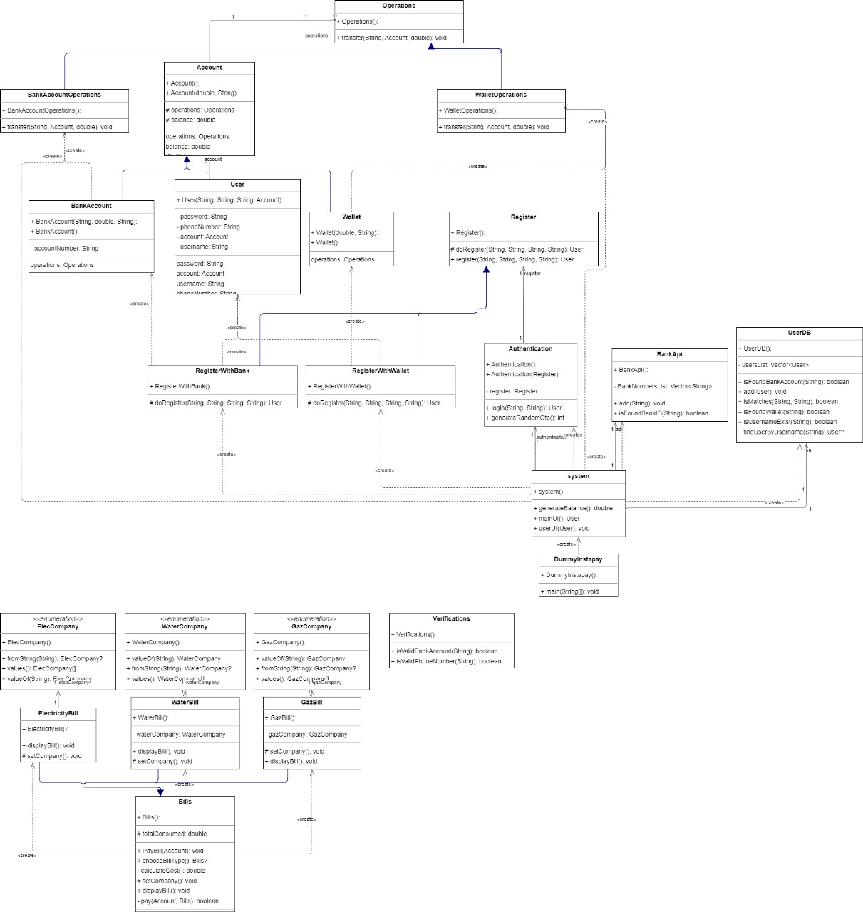

Certainly! If your project is implemented in Java, here's an example of how your ReadMe file might look, tailored for a Java-based application:

---

# Instapay System (Java Implementation)

## Overview

This repository contains the source code for an Instapay system implemented in Java. The system facilitates user registration, authentication, profile management, fund transfers, balance inquiries, and utility bill payments.

## Requirements

### User Registration
- **Two Signup Methods:**
  - Register using a bank account and registered mobile number via bank API verification.
  - Register using a mobile number with a wallet provider; verify the number with the wallet provider.
- **Verification Process:**
  - Verify ownership of the mobile number via OTP confirmation.
  - Set a unique username and a complex password.

### User Authentication
- Users can sign in using their Instapay username and password.

### User Functionalities
- **Transfer Options:**
  - Transfer to Wallet using a mobile number.
  - Transfer to another Instapay account.
- **Inquiry Options:**
  - Check account balance.
  - Pay utility bills (Gas, Electricity, Water).

### Additional Details
- Transferring to a bank account is only available for users registered via their bank account.

## Evaluation Criteria

1. **Functionality:** Ensure proper implementation of all required features.
2. **Project Structure:** Organize Java classes and packages effectively.
3. **Consistency:** Maintain consistency between system models and the working product.
4. **Design Quality:** Implement appropriate design patterns and adhere to SOLID principles in Java.

## Usage

### Prerequisites

- Ensure you have Java Development Kit (JDK) installed on your machine.

## Class Diagram

